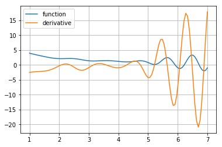

# Intro to TensorFlow

This notebook covers the basics of TF and shows you an animation with gradient descent trajectory.


# TensorBoard

**Plase note that if you are running on the Coursera platform, you won't be able to access the tensorboard instance due to the network setup there.**

Run `tensorboard --logdir=./tensorboard_logs --port=7007` in bash.

If you run the notebook locally, you should be able to access TensorBoard on http://127.0.0.1:7007/


```python
import tensorflow as tf
import sys
sys.path.append("../..")
from keras_utils import reset_tf_session
s = reset_tf_session()
print("We're using TF", tf.__version__)
```

    Using TensorFlow backend.


    We're using TF 1.2.1


# Warming up
For starters, let's implement a python function that computes the sum of squares of numbers from 0 to N-1.


```python
import numpy as np

def sum_python(N):
    return np.sum(np.arange(N)**2)
```


```python
%%time
sum_python(10**5)
```

    CPU times: user 1.26 ms, sys: 39 µs, total: 1.3 ms
    Wall time: 676 µs


    333328333350000


# Tensoflow teaser

Doing the very same thing


```python
# An integer parameter
N = tf.placeholder('int64', name="input_to_your_function")

# A recipe on how to produce the same result
result = tf.reduce_sum(tf.range(N)**2)
```


```python
# just a graph definition
result
```


    <tf.Tensor 'Sum_2:0' shape=() dtype=int64>


```python
%%time
# actually executing
result.eval({N: 10**5})
```

    CPU times: user 3.97 ms, sys: 0 ns, total: 3.97 ms
    Wall time: 2.2 ms


    333328333350000


```python
# logger for tensorboard
writer = tf.summary.FileWriter("tensorboard_logs", graph=s.graph)
```

# How does it work?
1. Define placeholders where you'll send inputs
2. Make a symbolic graph: a recipe for mathematical transformation of those placeholders
3. Compute outputs of your graph with particular values for each placeholder
  * `output.eval({placeholder: value})`
  * `s.run(output, {placeholder: value})`

So far there are two main entities: "placeholder" and "transformation" (operation output)
* Both can be numbers, vectors, matrices, tensors, etc.
* Both can be int32/64, floats, booleans (uint8) of various size.

* You can define new transformations as an arbitrary operation on placeholders and other transformations
 * `tf.reduce_sum(tf.arange(N)**2)` are 3 sequential transformations of placeholder `N`
 * There's a tensorflow symbolic version for every numpy function
   * `a+b, a/b, a**b, ...` behave just like in numpy
   * `np.mean` -> `tf.reduce_mean`
   * `np.arange` -> `tf.range`
   * `np.cumsum` -> `tf.cumsum`
   * If you can't find the operation you need, see the [docs](https://www.tensorflow.org/versions/r1.3/api_docs/python).
   
`tf.contrib` has many high-level features, may be worth a look.


```python
with tf.name_scope("Placeholders_examples"):
    # Default placeholder that can be arbitrary float32
    # scalar, vertor, matrix, etc.
    arbitrary_input = tf.placeholder('float32')

    # Input vector of arbitrary length
    input_vector = tf.placeholder('float32', shape=(None,))

    # Input vector that _must_ have 10 elements and integer type
    fixed_vector = tf.placeholder('int32', shape=(10,))

    # Matrix of arbitrary n_rows and 15 columns
    # (e.g. a minibatch of your data table)
    input_matrix = tf.placeholder('float32', shape=(None, 15))
    
    # You can generally use None whenever you don't need a specific shape
    input1 = tf.placeholder('float64', shape=(None, 100, None))
    input2 = tf.placeholder('int32', shape=(None, None, 3, 224, 224))

    # elementwise multiplication
    double_the_vector = input_vector*2

    # elementwise cosine
    elementwise_cosine = tf.cos(input_vector)

    # difference between squared vector and vector itself plus one
    vector_squares = input_vector**2 - input_vector + 1
```


```python
my_vector =  tf.placeholder('float32', shape=(None,), name="VECTOR_1")
my_vector2 = tf.placeholder('float32', shape=(None,))
my_transformation = my_vector * my_vector2 / (tf.sin(my_vector) + 1)
```


```python
print(my_transformation)
```

    Tensor("truediv:0", shape=(?,), dtype=float32)


```python
dummy = np.arange(5).astype('float32')
print(dummy)
my_transformation.eval({my_vector: dummy, my_vector2: dummy[::-1]})
```

    [ 0.  1.  2.  3.  4.]


    array([ 0.        ,  1.62913239,  2.09501147,  2.62899613,  0.        ], dtype=float32)


```python
writer.add_graph(my_transformation.graph)
writer.flush()
```

TensorBoard allows writing scalars, images, audio, histogram. You can read more on tensorboard usage [here](https://www.tensorflow.org/get_started/graph_viz).

# Summary
* Tensorflow is based on computation graphs
* A graph consists of placeholders and transformations

# Loss function: Mean Squared Error

Loss function must be a part of the graph as well, so that we can do backpropagation.


```python
with tf.name_scope("MSE"):
    y_true = tf.placeholder("float32", shape=(None,), name="y_true")
    y_predicted = tf.placeholder("float32", shape=(None,), name="y_predicted")
    # Implement MSE(y_true, y_predicted), use tf.reduce_mean(...)
    mse = tf.reduce_mean((y_predicted-y_true)**2)

def compute_mse(vector1, vector2):
    return mse.eval({y_true: vector1, y_predicted: vector2})


```


```python
vector1=np.arange(5)
vector2=np.arange(5)[::-1]
compute_mse(vector1, vector2)
```


    8.0


```python
writer.add_graph(mse.graph)
writer.flush()
```


```python
# Rigorous local testing of MSE implementation
import sklearn.metrics
for n in [1, 5, 10, 10**3]:
    elems = [np.arange(n), np.arange(n, 0, -1), np.zeros(n),
             np.ones(n), np.random.random(n), np.random.randint(100, size=n)]
    for el in elems:
        for el_2 in elems:
            true_mse = np.array(sklearn.metrics.mean_squared_error(el, el_2))
            my_mse = compute_mse(el, el_2)
            if not np.allclose(true_mse, my_mse):
                print('mse(%s,%s)' % (el, el_2))
                print("should be: %f, but your function returned %f" % (true_mse, my_mse))
                raise ValueError('Wrong result')
```

# Variables

Placeholder and transformation values are not stored in the graph once the execution is finished. This isn't too comfortable if you want your model to have parameters (e.g. network weights) that are always present, but can change their value over time.

Tensorflow solves this with `tf.Variable` objects.
* You can assign variable a value at any time in your graph
* Unlike placeholders, there's no need to explicitly pass values to variables when `s.run(...)`-ing
* You can use variables the same way you use transformations 
 


```python
# Creating a shared variable
shared_vector_1 = tf.Variable(initial_value=np.ones(5),
                              name="example_variable")
```


```python
# Initialize variable(s) with initial values
s.run(tf.global_variables_initializer())

# Evaluating the shared variable
print("Initial value", s.run(shared_vector_1))
```

    Initial value [ 1.  1.  1.  1.  1.]


```python
# Setting a new value
s.run(shared_vector_1.assign(np.arange(5)))

# Getting that new value
print("New value", s.run(shared_vector_1))
```

    New value [ 0.  1.  2.  3.  4.]


# tf.gradients - why graphs matter
* Tensorflow can compute derivatives and gradients automatically using the computation graph
* True to its name it can manage matrix derivatives
* Gradients are computed as a product of elementary derivatives via the chain rule:

$$ {\partial f(g(x)) \over \partial x} = {\partial f(g(x)) \over \partial g(x)}\cdot {\partial g(x) \over \partial x} $$

It can get you the derivative of any graph as long as it knows how to differentiate elementary operations


```python
my_scalar = tf.placeholder('float32')

scalar_squared = my_scalar**2

# A derivative of scalar_squared by my_scalar
derivative = tf.gradients(scalar_squared, [my_scalar, ])
```


```python
derivative
```


    [<tf.Tensor 'gradients/pow_3_grad/Reshape:0' shape=<unknown> dtype=float32>]


```python
import matplotlib.pyplot as plt
%matplotlib inline

x = np.linspace(-3, 3)
x_squared, x_squared_der = s.run([scalar_squared, derivative[0]],
                                 {my_scalar:x})

plt.plot(x, x_squared,label="$x^2$")
plt.plot(x, x_squared_der, label=r"$\frac{dx^2}{dx}$")
plt.legend();
```


# Why that rocks


```python
my_vector = tf.placeholder('float32', [None])
# Compute the gradient of the next weird function over my_scalar and my_vector
# Warning! Trying to understand the meaning of that function may result in permanent brain damage
weird_psychotic_function = tf.reduce_mean(
    (my_vector+my_scalar)**(1+tf.nn.moments(my_vector,[0])[1]) + 
    1./ tf.atan(my_scalar))/(my_scalar**2 + 1) + 0.01*tf.sin(
    2*my_scalar**1.5)*(tf.reduce_sum(my_vector)* my_scalar**2
                      )*tf.exp((my_scalar-4)**2)/(
    1+tf.exp((my_scalar-4)**2))*(1.-(tf.exp(-(my_scalar-4)**2)
                                    )/(1+tf.exp(-(my_scalar-4)**2)))**2

der_by_scalar = tf.gradients(weird_psychotic_function, my_scalar)
der_by_vector = tf.gradients(weird_psychotic_function, my_vector)
```


```python
# Plotting the derivative
scalar_space = np.linspace(1, 7, 100)

y = [s.run(weird_psychotic_function, {my_scalar:x, my_vector:[1, 2, 3]})
     for x in scalar_space]

plt.plot(scalar_space, y, label='function')

y_der_by_scalar = [s.run(der_by_scalar,
                         {my_scalar:x, my_vector:[1, 2, 3]})
                   for x in scalar_space]

plt.plot(scalar_space, y_der_by_scalar, label='derivative')
plt.grid()
plt.legend();
```





# Almost done - optimizers

While you can perform gradient descent by hand with automatic gradients from above, tensorflow also has some optimization methods implemented for you. Recall momentum & rmsprop?


```python
y_guess = tf.Variable(np.zeros(2, dtype='float32'))
y_true = tf.range(1, 3, dtype='float32')

loss = tf.reduce_mean((y_guess - y_true + 0.5*tf.random_normal([2]))**2) 

step = tf.train.MomentumOptimizer(0.03, 0.5).minimize(loss, var_list=y_guess)
```

Let's draw a trajectory of a gradient descent in 2D


```python
from matplotlib import animation, rc
import matplotlib_utils
from IPython.display import HTML, display_html

# nice figure settings
fig, ax = plt.subplots()
y_true_value = s.run(y_true)
level_x = np.arange(0, 2, 0.02)
level_y = np.arange(0, 3, 0.02)
X, Y = np.meshgrid(level_x, level_y)
Z = (X - y_true_value[0])**2 + (Y - y_true_value[1])**2
ax.set_xlim(-0.02, 2)
ax.set_ylim(-0.02, 3)
s.run(tf.global_variables_initializer())
ax.scatter(*s.run(y_true), c='red')
contour = ax.contour(X, Y, Z, 10)
ax.clabel(contour, inline=1, fontsize=10)
line, = ax.plot([], [], lw=2)

# start animation with empty trajectory
def init():
    line.set_data([], [])
    return (line,)

trajectory = [s.run(y_guess)]

# one animation step (make one GD step)
def animate(i):
    s.run(step)
    trajectory.append(s.run(y_guess))
    line.set_data(*zip(*trajectory))
    return (line,)

anim = animation.FuncAnimation(fig, animate, init_func=init,
                               frames=100, interval=20, blit=True)
```


```python
try:
    display_html(HTML(anim.to_html5_video()))
except (RuntimeError, KeyError):
    # In case the build-in renderers are unaviable, fall back to
    # a custom one, that doesn't require external libraries
    anim.save(None, writer=matplotlib_utils.SimpleMovieWriter(0.001))
```


<video width="432" height="288" controls autoplay loop>
  <source type="video/mp4" src="data:video/mp4;base64,AAAAHGZ0eXBNNFYgAAACAGlzb21pc28yYXZjMQAAAAhmcmVlAABMUG1kYXQAAAKuBgX//6rcRem9
5tlIt5Ys2CDZI+7veDI2NCAtIGNvcmUgMTQ4IHIyNjQzIDVjNjU3MDQgLSBILjI2NC9NUEVHLTQg
QVZDIGNvZGVjIC0gQ29weWxlZnQgMjAwMy0yMDE1IC0gaHR0cDovL3d3dy52aWRlb2xhbi5vcmcv
eDI2NC5odG1sIC0gb3B0aW9uczogY2FiYWM9MSByZWY9MyBkZWJsb2NrPTE6MDowIGFuYWx5c2U9
MHgzOjB4MTEzIG1lPWhleCBzdWJtZT03IHBzeT0xIHBzeV9yZD0xLjAwOjAuMDAgbWl4ZWRfcmVm
PTEgbWVfcmFuZ2U9MTYgY2hyb21hX21lPTEgdHJlbGxpcz0xIDh4OGRjdD0xIGNxbT0wIGRlYWR6
b25lPTIxLDExIGZhc3RfcHNraXA9MSBjaHJvbWFfcXBfb2Zmc2V0PS0yIHRocmVhZHM9OSBsb29r
YWhlYWRfdGhyZWFkcz0xIHNsaWNlZF90aHJlYWRzPTAgbnI9MCBkZWNpbWF0ZT0xIGludGVybGFj
ZWQ9MCBibHVyYXlfY29tcGF0PTAgY29uc3RyYWluZWRfaW50cmE9MCBiZnJhbWVzPTMgYl9weXJh
bWlkPTIgYl9hZGFwdD0xIGJfYmlhcz0wIGRpcmVjdD0xIHdlaWdodGI9MSBvcGVuX2dvcD0wIHdl
aWdodHA9MiBrZXlpbnQ9MjUwIGtleWludF9taW49MjUgc2NlbmVjdXQ9NDAgaW50cmFfcmVmcmVz
aD0wIHJjX2xvb2thaGVhZD00MCByYz1jcmYgbWJ0cmVlPTEgY3JmPTIzLjAgcWNvbXA9MC42MCBx
cG1pbj0wIHFwbWF4PTY5IHFwc3RlcD00IGlwX3JhdGlvPTEuNDAgYXE9MToxLjAwAIAAADJHZYiE
AC///vau/MsrRwuVLh1Ze7NR8uhJcv2IMH1oAAADAADVayF8oYJVUBjg5Cl8UC950wnQObmxLpMS
eTd2N1o7ZvU7nZLqidQWs9IRqH4qZFuUNOvgrgAArGB7WlESNB735J/CfrjEy3i5zjzWx5r7oD4b
7vRGf5YZpSE2SfCltWRnqtLPBS3FxRjhpp/BEdar5txSfEu67R/ppgZwAi2i8ff512MwmU2ndVwZ
0/IypwbXeLiexIGKwjGLSLtuFQ6Y/OKysfXRdbpNhUrKtfRj7DGM8WCX1Bh4c330WAw+R6EXVRFY
lu5UH1qoQzyL4+ViaXbsk9e17GMhYcjYQ2ErNh8GLHqFB5yll7cH5+/ATt414OGqKJBfavN2H7Eo
MYMyQUJm9f6njg6oT6RI9deVwCrdBzM/Sz/x8vLmA7OACvEgs7ec3QswOORd/etOu0E7t7VpiB00
hKHHIDZREnqwvaNj69QpwDqX0pss1cRClh94zlgStU4c5yUCVO+HQbSt4HAXLJj2f9Btb1Gp56ii
Oi96XZV1x4KhUxTYawQAUfjzsl0QevSEuVTVlSNIsvo+7QD/x5dqmV34q8Y/e22ByjofSHxpk/7U
JlOIzg46ZfH1hLZgWW3R/niY7hJcJ7T94UsjfEkSh3TDgfcD17lLYnCY2sdzwQUX/M7yx8DlUAxf
Bf5jCXE+1+wNMg1QAvfybm1SjIO2TPl8BU8XJsElm8w528BUCYhGy7qcnRnuSy6QxEV7zgbX58W4
OX++3kHg9QTGgyx+9vVBAdT1fCClHX4ANSaqmTCW59ftwD0BujqkCCWkUJ2w9uAMrIdCjsnjVQgY
usw2C1nI5upe6qRnHhMYO+//zOhJwy3GFabODqjJ8LP6JD9HicRvbp/KU0u7QNM3PDeCZGEppIp+
d+A0U9LkqJcqlVU9QxjMxe4V5wWiAXVz7X2hUEkcgvbIBu6DDirLSkB6X62ytFi1xHsjrXMwRBoi
23k/4WJeSt9ercxBpim+OztNcFsiesOQP5sSGoW5wkc38yjAPbcq7Tdzbk/IrDDaOdxl5A3HGLvo
zZ1BGOReneHzeHg/afksZWL4VFYt54t3/Hf9K1pP0qpg033ec0POTLSV2EuXudGEW3w0++tbXV/W
TzfL1OHthmmQR6IPVUHFMoqzp1QcXRtQTOdfyzhgBiRX5WVO85tv8+La/kmO0HsSZYHMklOP3co5
QDWHzfJAv2xFzpb4zaWMSFkI64HEJiEbYjDtCz5R+5934JrTITw/HoIDDZMsJDKJDy7tEPbaSA9e
Rs6mLK1h7v5ilXo8fU4zXpoO8DIuXkGCPnMytYPsejoVgG8/4hV+pdupgbZzrYj2YP/KOAfFDlCb
c+Afko28P+APuNw+AREopUusHlOjBttYqMfZpF0lXHnSyZGaC4E/9t+DTsSLLdxT7j02EJ/DJYcg
zlbYlWxHyR67M59DOduDXxQ1yVc6Uv0xHmi8cZyM2klmNgFAuAnAXoBpK89d0ninH4c+/x3zxCND
gVwld+ZkhAQLOdusrHeV3kkduEsmNVMMG/Z4jzBVquh65pjovblc+tWCuZM25L8WnssoH8vTmfqk
8z4vSza/UA18+dAwWnRG9TaD1J9lDGVsI+2H5s+SHVWANZOLLVmeWQLhlKcLusWsnTy4W6Qc1hK3
lWy4lqZwoLwKwRWbX98yP5cBLAAAJoy3FrpsDsUYtE3TL3kuxuFVvIqfYjjoZ3q1MFTJsXRq06LK
CGXjzDp6hB7mkW+cUnSDxxWGDOoq2FRt3I6jf4pVWCtbujN+OSzPO8fJfMPqmvW7za2IZNH4Ivtm
sJzTRzypJjeyJ0gkQxOt04Wtpk9pR8wFijYSlPAPe/xLLPTGlzVe4z/sJ/ZxT0sXez2TFb2HS+PN
5fGrWLRo7iTiPCfUPMNtVVeW8QLshluhtUxaeuzxL4KRaXWDzZPD3oCZy7l7PrHjbnsCu+QniSLg
8rdR9xoYbwUQ5YwHF3/Nci+zL1HxGZ4L2fog8TyKfh5YrePpnYaER/liN4NOXHG3TyRUAHQPEB+O
0fmDCiGW42CFp/SOdacVMu4hEherC3AgxrebXZ6lt57G1D6yYyf/mXSrjlMM6aD8AzMo7YaVi/1Q
riXfAbGXkxyMj9BfJMwbTj+GynyOugQf/Ri8ucxRM1dfn2kFerYby85cHDMQ9lc0dfLgioxLGqWq
oC8rjPsjgmTYbWjjaA5viU+h3WQwUXncbC4FRQhD0yz3P9NlsUrJdkV2Go1oMz4i+CEUEZ2ZkBJz
FarjflXpG/8+IATcngfdDr5VkKobO7YcOa+0UnNb1BisIZLgIINH6bNOX/auSFixOuura7NqF0w4
yktpy6EiUEE2UhLILpa9OhwPj297SHzPzpUJ7OzNirub9vTQ3R+DIb3veZhh2NJs7ng8D4fp3dwN
kg2bGg65AmO+f0zYI1LjeuzwEPQ8nUEw/JgiwhUDfBlwhDpqvABLah888nCPqf9VMblkQvYaNqv1
J1XnKb4fdkbYTG689HMbVdOd5qFgHz6mOXOzhLIMp+mrjkBhzIUqWY8MFa8tkNz8AGsvFdQ277DD
BcBoaY0FfW6vZrHoyHvO+0rZxzfvl2VAH2OPcyxY1KAVkaiMyg9tUJhQCCyaeCAaYJRX0POhs1nB
rxNMmd3vcuW9N0qbkdUhj7FxRU3zTdBE79H8IUjU6e8m8eIs0V4RCG4esc2vL/zynbBPEV9wOhO1
uBCndBnQH4b6dhF+XZFlGjLyHbPuLPfLmBIBWCYq2eD7STVpE6PJPuCvAmbPC5m0lPNpZWo+XO+h
+a9vrXVhUbtkbVatlRKdLRBvsnANQoy3YIERU7FTrr3HOGr5X/cxFJcG03ynZEGNtvBsxCPM2vVz
9xydhy+xgUsM2+kb8B/t+KYu1BQXKB1ZwCnPND98Gi9c11J0/un/nSwEoU4Rbcvfq7L3zJIxZIg2
0mgxgx1gHCPdIlIiBtvD4QUEWEHCG7ocN78Fs8mNp0LEinC8aEASBNw/mSOHLbwlkZbujn5bLpce
KapAHON2Bx8YsqXBTXi84R/vZWum7aY2uUpP7TlWQKJclnQ7k1MVA5kVVK4Nj74cP7oYOzfw7uZG
oiqDeFiu+47tFaAiVDfvaReIxl6EyGI8fkgsG8iqAP+AmdeKT6Grilk7qacYBf0OcfNuqhyyLwIv
3q2LML6SHM7Ec532aC0ISAZ14YPV4zsva9vittTo/hQcxAYlYukhwZVusTE/MSNjUqhqMyRDrwX3
IKO9K/ImCewamz0Abw3iaqNh36pRIcchViuFje65j50/0pv1tN3gzhv/LBizr3ZnzgKDOSeMqyqC
DdzUnhg3pwYphty+qRZgxa1OlBAtusjFLkDDk++oIPQRjJ+f74dtesy6yvSuYs1wYIQXBBHxkbGk
ZmRfiUDlOz6xPzU85VX66Ntpd6XX+Ce7Qe1kXS/x+9K2fwdvBPNoKR6KUzKUajM9UX8Xomu+F4ZX
nSkncW5U9clHujca1lv4Boc1dM90s/8ReNgCCBayK25GZmLmtO1dlqltK52qd8dzuus4UASSZDJT
2ZVYx19XxQEjQlQzMhCAqasSb4tvBsCbwIkGNwCQ7mtJpzu7VVn93Pr0s6YpQOHdV9bSxjzkQKry
5+O6BTUi0kWs9Iq6sgACfQ6y6U4YrLKvLZlNIzcVchjStS6T9o+P825mB7swMY0DdjufxTHng9kA
Z0qM57iUJoJkPtUwZhNdyky3ld38NMBvTw9/60vgGfUjig2+GyCIit//FAU8YsqvjXWi1GN/OJbV
H/c1Ju2J6H2F3zANdpD1ehzoTpHRlBIfTx9kXF9+8uML96TxnPKIT5UFQ8um5Qp41RXiFywjLVfV
dcUFIy8Ok1dlVAvG4M/mRRj1aeDc3VQd2Gf1u5A9O8c44wLr1+h3pQSL/w14trFZYT8w6KWRqt39
bM0KwH2uODLMng3RUyTj8L4oIuo83xRT4wqRXrALBJjpZKFBBSvsVMUNNz459qwYJ9wamFP0CDK6
l7NET9O6z03guxSfSyZQ2nLL3D6JHdqP1tMm+VjQK6MztY2dt/wRczmYSKeR9bXkUgHQqQZ1+Swp
E6dgkYvV/QnhBSN0AOaW97XQBgl3rRLCKx1XnPrIcnFQKWboDatGNrUriZ+aE3NaH3yaNHLVkJUL
mRNWRM34AaDkB+JBVUM7bGjmOHIqQZC9oUMW6R0/qBWpEzLHTV6awDwF+ms/Zk6kw52T2bRVumq6
DAWjiSBdOem4+crtHSBAOHykWah4O/1qY3NVjTirvTxwmTJR8hT1bd2QqA9+Xy8TjOUIcgHlv1Us
W4aL2MC8IdyKNdyUDMqlDNwEHTa1sg+0a7H2gh8D96veLzUWCB3MUTxwKl/+rBF2nJ847hOMa3GR
66HN7NEwLsA4Drn3DWp2xeyOGChDOmI897pfBlDwr3Pe9/TclQiKEjpuGl1ATfTKxEe+s1ALAMch
P/IUgMzR/36a+wvDoU6Q8+hcw02CaGQnp6ztjz2LF9NlJZUnABB1p5L7Iy+piitsE7mHdXUX2vNo
hyG5ZTZSOpWqbSZOvopq6ZHbORdmDeFfrIL/MkNbJP8XLEYUZ6pVP/EAvoBja5zIi5Oq0VupY9C6
gNoyZHodJWS4s0KueLQo++74Pn3sJId7xhtcTc8f9SCxVk6nyksYSXy8STfSfEG5TdlhBk7heQj/
tORfMc/9KIDXYMoGnB2fI7+gNsPgQYBraUBcApRBH/xsss+qZ7sC43Oh/GnW0huai89d5IRnmPEN
/DN9EefSWAPmKrDBnVOdrzUDugVpKPY3VLJ84qH9wKk72rM5YMo+2ahCW/oxHoPpzqKWlVAcH+6Q
qwgcK9v72EB9KozL727ChOzkoXdlpsXw2B3kKMAyov2OOc3a4rD4fg1rEXD/ub42mh8d9sf/1vNA
9275ntzQWdlSTzIee0pT9Ok6+bLkHhceZZr1r4tZgdENd76TFD1MUaVQMo2/CYjzJYgNxvS4rkn3
IcMyKQ5eGWoAPOaixTBYpnc6w9rPJ/1MKwPrFUAjaLWS+cht8elMtM+ufgBLyEosOnJH3zqw6doI
mGKdiZwnir5MC+Jc65gwCin/Ec70uf2TuqVO4+B8PhhAjYbUO7ZLT0T3iaH0vDMwgShJxJ9hW3vZ
wLlWGWZLzSICdWKHFhXm4fFXRRCcd6ifJbTmRJy8q6YUJG7C/1s2mwEp1cjcLluv7ZdrndD5L+0n
E7NdErBSpRoJJrqxlgDngGe7mES0G0z9voMqIMFJpzSHoETOCl2/VHNx3i+mwvR9PGpThv/CVzIk
ZEb5NcMW5LkqIk2QlfBJyRpCCFeIn/m2MYC//LJHrfyVTzq/4QJQ45+wKcLx7oVX0W8TfAWbgWFR
OzjHMo84go8r0CJ9JZoYfBspPmWwK4mcfa3Gh9j/mkg5YyU1m9dzDqIp7Dfg9UPW7YFJwJKvFuEq
I070OzdgAjLszJ7FZQVvehR5MXiyN7k676RZMkYa/RP2XW+W8d2B2R/L1/RuykfO7Dzb4vrh00au
Xkf6WD886e5vqCA+KrswdfKS/xl5jYHkF6ym/UPMOhugJjUFY+Yly4+zQk3+lG3u4XUtOxG9ThN/
ICZG+epLilcvMDQxs/m7YRdybXXyWO4pOEAPktmbAT5i0sFxtSZ4GbLyJGBTXs1mj2FvgQI8zVZO
1bXkQntn2IvhEap3+WTKC8zuG/jZVIMWkDlWNHyQ2IzY63u7MoE7OjijTGqhLr+iZY89OZFBNIl0
UZLoBnA1gPi8aZbHKq3pQ3AcpZfBnXaoPWNhCWco1z7CtudTdEYOXsdec/8WMR2aCvuKNH9x10M3
gFZsCLb7zg64bN7MsWZvzsN5WyH94dY1AexyGGv9vMeWOgRLXw68QQRGvjzdXGDc4/7W4Z9O8lsZ
lWQEO4LJnm9DfDhH6JKVE3I0nbLv3Cz9HNjInVb4pkeDw2xNeDJ/SVB7bT1lTQ6TbixEmR5MfhcV
VS9MrAM83dV/qCyereUtBsEDtrImll6Rw1N9uQem28Ojgh7Lr8PL2hdun4YltZa6EX5XLfoqjf9S
U+z2biE8Iy9ukDViYyxYdFKqzJOOLceORfthbJnERgiTEW6NQCKo3UkgG4VkEsLMqmH3gfuayY4z
J1fOwlM6TIWpXm8lnjqnkaw+OFqSTDv1RYmGn5Sod2N4U6EGfko+f5e47mS8ME4HRsiDBs51xhFZ
9rk0uTX23s+LpH5ufOvm1xHWOMIIlLsVYpjUZtrZRemw5nFfyhxrahx8muI5rrLtdK8wpUaelSgC
1FrepfSRUfSQAdQUDBo/LDW3bIjz8axp1y7xEqYqZmlE3VrPvtT++KW7/R27gXWn/XGIbrLKLiiD
Z4QtIOX86bMRMz5RSyxDZifQPuBk/SJqvQ3CUffFLJ/VHCsPnjh7x/pNLRHqHj1AwmCMUI8BHkZc
A5kpxenIYv6scdyJ5zZO9L+eayczJOnsgtJKgGK7DjQU5tioP7ffpC7IQRdgd+MdkcZCyiWkzYr7
CCtLcW3naydkCylNXm9qEZCo0nt5ExzShPWFpnLNdx02xhVPIaQVdruTKWDG1BsdRaP84okF4p2l
rb3Uopt/TrfJkthiN8AYt6U3UIE0HNm5jq6mEO5g4oNONfvDq25+xFh0rtRTYoVJQM9IO8XnFJNX
G51OHdGUVeET0i++SRXXgnEn7HWazFf0k05zZQ9Q8sXJjc3NSaet+z1C82JZev9c/9yDZkidlWdB
eYjhKCFi3RIrv1EGVIBHfW/TUlGemrs5efML4rVDmK58u4C+eM9psbeI66id8y4pMTJsKOZtoCWk
kFNHMyNw/THoNhB5f9Q2NMRSTwDj9/bD/MsZfRhQha7pWDoF1VIC5R1VIcfKt36laltP27MFIowX
FCgOZwhAtLejZdIN0+/1OrE/A7pU4iKr8DB6G9r8hZU5eY7Xa5JZjR2YspYfkMFz/05NzlhS0N2J
TAIRxHh1O7OFPP7EmLAnXR4xMrnfNf3iKtRzrj7LAkvnSGwlZY3s/Lz6zxVHk1p3glXA3t+w34GP
UPE329iZM85eNq2YB6X9kqCdf+syLTst5UaWWXC3d3qDRbPvlPUYNvQx9pxCgp6SVOjBv4K68W9b
daGVWruFL0WlwVyWJMTQJ8pw9U1yzUTUgenqMdhsKfRI7jW2bv5yMV8O9fLbEsqyPo9Mevnx7KLw
4lVEnEsbRmIklBFCPb4g4WhQYOhLGUFW+CINFzV6DXVyEntKT6IXUxxrXL/tH+kSyGO3HOc+He0J
YfBBPxsJ1iaOfre7xYnU/5dHEJtNf7bNbWx6yraLLP07+nBfCwErIki8JAsvvep5NguD0dXdytR1
xqsaaq86l/6e01V+V1xl89hqCD7AUpkNVZV7hZkrLtvXxhiAqEC6032OKmyZZlipMrUmkx8cDaiv
WPBacMkzPhM/IyroT+nreycPdEPGlFsD4/VKIUa1SV7Ijx0k1dlYaNJI7XIoZ/WMcg0UuixktQ6I
/ar6gdv9jMb/tNt/7Tx/+tiizm31xvDoWnf9fGcGej9Haied3a0uwXeT3gSybDVv18bsVanXdCnN
7wZpGxe0y9K/WuWKpCQp9nPdu9zaBZ/xRFY6vnA44psqrU5NW4/zFHTUqf9M+GZRKuxIuQlg6wl3
Ub2icGgv249dWhZPjY3erLWsCwRa6609QGHur1+Epdi2llj6lkw7HNvHGAWf7KT9PvKv/2u6r8Gc
+YPWmJgwF11CaFe4v/U5MXQbeky3yCbsCqi/mQWx4YwCpWo7XoTBIsSjCzMNx/xacDC0BXPJVQAe
6Av91qAvFaGUZIIHUMfj3SHYQZFZfPhkwEezSAEF5s65rKP1R6txKJqW9LGt7HaNB2CM+YnyB5ko
fkjXntEtGV4Cv0cXcO/rWJMvlRUkoinoP/vrlvWhcgnVnHVdV5HY5duEf0wXKjhRsfplWlhcWTGX
idoBfyi3uXvDZ3stvhrBR4AyI7TkUy3NzcrGBxDQLtBM0190ykpBhnI7aujU+jegRkmSpgnurm2g
R8bgfm3p+uFvic+2DMw7LNCRVUZ8pVxQaq3jucZwm9S91WdRhKa1MfnV1NjW592tkMQQbsVwg5hD
aT1LKhmEM8+Uxyhz7Ci/ob6dN6FmQqwKovTlpJlyNPHH0rogPbdqKrfKPEXzicwQHZB1xs8MCo++
IQqt46pjT3RktSQ+IO7FBfav9Pfi8HTA9ydV5UDFEQYDM5OEJsAs2TFcV+2aXAbmfXw7iJolND12
oMiC2+EghG4pONtn3tGLlBNj7gPqAdGLyN+iJqZBd8XxwqDb8Kyq5avDzcespGOkaogYJE1RnMs6
Qe+3zy6pvyd+ppSDHl+2iHMDQyq7x65cn5O541B0Mm4MC/mb3oP3GTkjaNjLc1n19Yo5TW2yoxc6
dYMoNceVY1yedt1xpmJ+OT1fYS7goWhy757AutCt0EVoNk8O1Ofc1C43+fiXMT9bUX2G7kNgHr8W
DJqZiymGZ25tYSbAlINsOMmEFh1kzyIhpd+6bJWJn7TPEoIjD4WkbwdGAgimUhzxyaiX16v6/Vpc
bzvL4uoIkjq4iB6KjzfjPKQjm+BNChdQ/lQHpmSKGsl9ELc0SplpVizrynpmgP6JmCXF5cTkaaH2
2qmi24mCkm60ZJJo1kUHo9Cv+Vk8jsgMqVDaVy5xkW56M60wsI7GM9cMOthS8PJPfSr85mg9nTBc
JrMibYcDcznGkWo0QjXPr26ZzHgvPJuvZ++rrwZEAww5vzCGFEk03GgtDik/R2fa9zrBT+ME1sX/
xa+6AcJoFQrjkor9FOBad69bov4uHU3t9IXGgFmAmcZgdI7Idd+uyjJKWMj1k3QvJbaM9p6Eobrv
OEjDNkdKObaij8Xyb2BylDNN8G5Q77gaCYDaNR0sIJgdh1C56ndkxIuPVH1EqjIIqylKRc+GQ/Mq
gDFZ5Z1O3vLD0OJfxiOde76LX12PJYAo2jDrh9HLRswUYM/9unMdQZRHQ/MNC9ph9KmuWOP+6MZh
cu6OxPCkA5MSdhhBHmmp2E69uIm8VxAO7038VoX8TRd9WwURJzdg8iycHHkuyXuSY1fJX4cQlQ0X
YoFqiL+Sc9FUhhBRBYFciCtQ3YepzWmV6kQLwuEvI4NszQtjXOQSC1kHVKNzQPvTcNf9ViNcu5Kb
8ChEBvD+Uu01NDFvzUg+sXyi1DwMANKr3+3gf0VPBp/aIHXgvUnLFzXt4G8PeZ9/z40DSzFq3+2O
V2iu++bMURWucYzLVQWpRI6rGrqHrJli/rXo4B1c6KJX729z4PzHXY88NF7Q9Y5iQGhuDB3BxaTZ
nrzvd1taKmi/dIsaYc45ZNcBqLJKLODcniS0/vAdxsobXpTw5P1+tduJC9l6QrJIfy4tWJSJUgKf
DERzKBIi5ZNVbNZt12HNPbsg7J9ilQLem7anRXqxjXdEFE8pL4pCaCUiHoAcN0+/B0E6P+TjlR3U
CgTyqBT8K9d5JAEK3FIwDv6cilgG/5KAzZ5+iMes1MYkLE8QdtUbF/lDmYWhpRFgHQvUoCN6/+TA
JFHaEmv8OgdRfxcvFZkpeaWh1L84ThEDEVVilyR8ghv3rsrz4OyPDZ7YmtmHB9cA0esuDTT6xiMO
UfV310JeHK+PZw77u7MBCFkw6Qp8HrWUOjmTHU91x9StRa3Gd2TXXqQfUo45uRJ0lCxiKgD16YqT
fDf7blVWxoQucoJ89cppVGwljDiytdjAVbRBWcJlEIGeNugDdElWNIAX+lxjcWy/DbLuDl13X5j7
UISd7OV9WugRLzZ2qbHxPX1BjrV2UALigH6RZqsHyVlxgbZ9e1+EjnVzKi8nb3Rnc+OWB2pfUZlf
oGKum6NV0B/5wD/xBSrsdeINFejRQmaUOhYTbCiAP1PbeYdkiXE/nehGnwDpmwceQBg34Aes9UOo
eYa7pAk0ASxT0bulVkth0DlSgA20jZvzKXDxTOOYbKvWSv82x/eYwHqVpUj6x920lM6znkedC8Ax
w6vegSZj7dAbnOy5/hJcnBMDkx/sE7uChkUW88uWwYA80/O3kGq0msURdxML2PWsSevszDZX0hV7
3vPrLjqEg9nFTnVJUOOkBd3tPJJ5weeZwuIo8ST1IrSfR7GgESifMH0LwQMhU7EA4qtGOQww/Ay9
NivTIvKVwpSK7L1LGZQX2qWAX4RGZbI5rbADjCpT3L1IP7LXN8jqF4mMYecejzFDwkdy9Xs0Am7c
17JKZZh3JK5sVZ66i94COPJnue7OzNnj24dVUdtbyzMuzGb7bK3RHxzw4ZDsZlbydYfWjMhjNEnk
mb0HdrVPCw7cAXq4MrkXfLs9lIOvRdkCY8Y2sNNvKCmfaRVzU9NgkAR3Wy2s7ZGFXplgG5JAe0Lr
Li6datP9zi7ThanZN6uOpgSXwiIjvQ69V+b1IGByOfrBtWa2yv8enUibwuQWJrLD7OqpzIzABrHM
zJfDh577rCS5esclgG0ptRGhUXbM7OiIA8bW0P6D4c9LSYSYLhwo/VCmYLh7BiISde8ngnmVvNtm
Ic0Z6pT28rafSjPFUsCMwuaZ8OhDSTGsMicDhC4Y75hFvunoN13pqr1/HknrReu5u2JvBH9KzaNU
NX9O3+INdBrsguAcaRZyf/HZ8/VvsrhVe3U0TW2U9IVXyXfFjaDpNIyVT6N817K8pIxkiQJ7JaoQ
QCXkS9QA38O68FHDa2zBY9/CHV3YqskCUIRtQbQOx7NhiCBmmJ6I7ci9oigTjtgN5nozJPKXnhjT
uucDs0KPdeGv9dve+oD5uho98f/BnJHzMn4P729H1MIFHOUMKFDkvFZZKQJzFt2l0Smbw7KDUDfl
1OmW8SVfMaZICick03eGhxR54+D9OYU4sX9hi1ADnaSgi3CAj7Vc51pxmRItxKn5YCPCjeWJYxGH
9Vpb2ogXwBz8UHzMZf6gnM7sQeu/KrNqbiDPMkU1PsBwF7kXYLZRWdmv1hno1unFhMEQPQmntrf3
snsOT6+mIz6CYveMmyND2J840bBthLM2WM+QUtfwOU14Kq5ltj9Qxvb3LhlkjMk331QJ0ztkQq3r
VCGKoMkrBWqgxNQBGCnwhn07v6eDD9dYAji4n328OoeDSDuKdd/ZWewfqXvXvAhB2Q4eemXiU70H
58Ul8QMPXlJcFEFEdaUq3CWaInRkUbigTpN8TbehfKXCMqozNKjWo7w6lP8FBuQZxzJisOqDPllG
SfqNBjkUIUcfH356uZqXV5vM6BH6wS9GLqPRpehteTYwbb3m65BIwQCUEv+KcFZzwCJZx9DaznP0
27S8W0nC7tFa8PNB4DSzk6UGxiTvYZ94KSTkGwduarX/Sa4J6TumN4vHpoJ9wNhlb6bTPkggjWUK
/9KFXdLtcRshaBSK8/NwKoLPU5zyJDyongoYY/Cm8u0ZUkZqwvA7TTdbp9+HmkSCJ+Q25Zs2CX2M
zcsADrbLqxmilwHLoAxc+cWPp2pw1Mk+NXUK4mryRYzG0f/yVrOZIm7lPODfcv21tvYQ9YV0CmfU
J1Gesr9FL9U3l1fWlwY2uIDyA/gPt9aZLGkEj99r9g9x8HbQdP47xyojZ8ccHfrBeMNb2v9+HL15
FXm3hDUAhLuasjcbTTd8istvjDyMgnlogN+4w4i3LM5O2tv2gxHellGFBqv8AYZtiX/hQIYyW8ue
xhAf+UjvIytmhPyfOltgob1WiIpohEO7bLg8mQFzyhYFL49nC/AOl/IHnHnwdFsO5DmW6YC3Zq4D
uNlVuof+6nrS+QarcZ8yTQZU0fE91WJMtrayGbQCJ5upSi3tFppJFAfhvkni4aiWf7wiwc5FFilk
N/BlDQo5Fmkf/+5LdrTa+6zHPfFP8uFbfyUzRU3r+/vCFK0xC3zosQfBl2ytCmpXfR7F8U9H+5/k
DFuytj8HpK2UURWL56YKBYpPPoZjN7O2lNmJA2vFX1E86TD3qUsYsfihtZPg1f+Wq2UbCsoMz8vt
F441Yn4Y4iAnSeTiwQ3PT5p0B0JCUQOgwo/Wju7bVYE+z3Kij8n33Qg8KtWXJyyrTsaK4wosC5VT
H2KPLfCX6kL5qNCB1GSIlKoEBWKUXfwxHmlZx/HpfomRU4KPpKwceocmLPZ0fTasvVZktW9oo9ZN
2H5sLA7TOpzV3pr25U6PtIdk1gzBCwZ98Tt+0MSqRSH0OcCrvbO7lIftwnvOPr6M4MO/Kpe+HFId
rmrezn4FtF0jZcevOdVTjHnAQtzCBAKxRteBfk8xab/461Tf6CbKQh34C/5AjzDnCI7EwCsBA9qO
0Vh0D5HvWhwcdNnSCw749Qi5wzO0I16AkmfrveQEsKT8Neoi55tD/RMm/hsrLfYrQ+dHa6iJRJAs
eI8zlA94e3WoUlnm59QxLu60OCR5ngRpPnhIge17JVhtA3eran3T3vI/WegIT6ERpV455GeZfvC6
p3JVHVp08Uvt8pzvFxeoLNMD6r8hP5pWpgjX2TVGOSmbvfRjKDbEKz5ja5737XU//vHql5OfkXQJ
ZuFMosqxHsuUxHI9SCuZs5A+vWninKysvcDC5JPQofaguSqgEpm4TeNI0u9xqx/qwc989/+kL8z0
WJDM2J4ApgqI2/Ui34gVEHRNU2N8jD81JHmljfesxXrfL5YS6fp5mh2cu71u89BRi5jQU8p8RYSV
zvVLOcOdtIig4do8j/qvfgaVmuXcVCkM6kU9iT+2AKeyxrAOCZTgVOnPHqKwuklSNA1j1LFvcIOh
ECPAgceYmayduexfN3XZdPGLlCpyi3NWSFVNMZoxSRdi8RnYWyfF5ilvHMyT4qkBHdx8J7rIZwR+
xSvca5rhlbBbXHYeH2Yr0vs8PTg15AqOh8BIwbRT1e4XPWTF37UYKpMJmSPuxGPj67zrPxnr7DHw
ij70sZEJMqpYrRFIYvLbCBUcYR/ZPCfs8D0hqtqG0svNdE43bC3oLeCllRpcbnFHO0Wq6Q26mfHA
uq7CtEejWEFVn68x+EQekyOGX/LofuhChhNf3iVWJPkeyEYDFCJuy6WuywICD+3ECzzkZjdAYm7G
kAWHPlWa28ZE6YJQjXXqepFtxBK1bDF0EGcqJ6z8XWjMK/FhuIZDFqZihZlgNS9IMjLRdYPEIn+v
6Wc3ryunM9QJRoGjOVZVfSv5Y9RefygJffsMsNsdu3G0QmYSCG2B1Uasy104US0wauVX2E3sMEup
dHzOEE6datJz1asmsCZeDUARRb2jUVVGapBnfSp3n84cE8cT/OxYsGNIzFEkH5resHxma/2IE/GV
dRbWxlhqTGkC+MuFWqzAGPflKoTrP1/3vV0KdfvXFbUanPJEJyuIzhHBoZEqsO1LzIHAt2kZEaMd
5qCFASMy1cTpV1djYZ4f3Kp1ojbTgZ4Q18b2RzP2/Q4rCSlze4LaGKuoG66X/XAcjRPPJVY6TYDE
sdfd+kmKGkL/31ownajeuXXw0lElqnyFUUL54BCDMQLoy3E/SZkn5ET07MJuknXWUsLK2/ZyuHIU
YesFhcu5FHk+h54KWvjmT/YiYxUJha5bjzGKpmJoC9vPb/SAK574PdPTo90IqxsacP66r7aBDt99
8jP4VHpJP2Vh9CkRlBZVfFmzXytwO2fikPIfCP2YxX2R3P6mc4+ASa/IatfvbJH+w9bmK03n/cYr
jK8VD2FeXrp4Jr1RI8VzpEkrEshIvF9dGsK1XG3NUWGziTEeznu9UXW6DINTE9ThEUTUhAH2dzIQ
qG+iHIz2fa8b0iIv/Hw6CIpj2p2luv72wOTbuDdBLjmU3iWXizKfJaawcsHCsQ8TXP1If3FOCOIP
Krs0Qg93ZENadShUPO9QBtQfR+ihA09uMPgEbPScxYQzr9YY1eMj+uiLV6R61pN6dopWnFWjE8JP
NA2aNeo236yEV4XSj/afs0RKp6YS9cZ8w1TaR+gYXjiJiLF9hG/F0we8M+ulhstRKy4WkViTqDMi
XliDwRBxM6gzmyNFEz068RwMlLwc15YAcpyLsg5VXG1pmgmB5scCJIEalw9mT3jLDhm1iGEkBEz6
33SS3//g9KPKFIrulabkIw0tf46yC5dSGqfZEKWZ9X0NblqZ9IxfiCB8vK8Qxug2FT4jGhzaWuEC
las3rH0Jv4aJdYwkbwpKqzlks8HzaYsBPzrhg6YvrmWluPB7Nmpsp3Do0BsjVPkq1oFyaeloNJB3
tKb7xCfjCAOYTZZ+hitEykA8PbDgMmHXK35JAu86yWEfcnebdNZMweyW2/usE9WtlLbFQsb/SokY
3a48Xlz2dwFxvBrUB+1F7dBPP5XqWtHNVn9Px1oNkrtwByBRJ2YHla2eLtbq5HeFWle1bR0U0ESO
5ET31+WlcYDltAB0ekNGST9O3WFgED6eqhc2iizq/z/Nm1eOqr3yAiO5+eMyH6EFxMWHt3EgkghX
nCE8sUExZvwxsVA4jurTFvc0lLFWgzD7qk5Hq/zzKJYX0aihXNr63pyG9Cc1Vqrtjp1LKKtuLY3N
B/feHdpsjPsn2OM8VaW3ECOB8DNDLQwg/FqMwgcA6UsJxX5DWxNRoSeFSkQA/xJINl8TmO5Om+2T
wIKy5PvP1HNkdGFcgHxqW4t0kYQx3ST4b/CPQkZB+22gElP9Sq3JzLWlggTk0ufu5UsnIPBAeX+P
pHsR/TJEteQeyjt2fE7yddJ+pvJsfz+CELj896EypOBG0frx0iL7adIgVQHXLjiV8mYOtolpxoe5
3IFDsJd//TgF32gJ3xT1AJdLXv5Cuz7WH1/NKMvUmTzfL4VctCuCCxWOzzgx6mdsLnu7Ax1DC+Sv
yjU9MeSiSpF30HRXjMWoFyq/8rMcx08XkDZZ0zw4LziujlGBur90t0S1LtD3LyiS/GG8HTQsBLtZ
/6eHWgTiAfoEJvu209GQh9cBf0z/5KSj8Hc8//6CyxC1W/jOsp0jTOCVo8w8UEtX5s+tLk0YEz8R
oV+ovRNBasfdGTl7LcL2GlllVbC+Cpz/bvq37/Eic7j1RwBsB+C4xyQy4OGDK3gTABTaKJR82Mz/
Yhn08Isk5fMA0UzqTaOUVxcPSiDnsMRIdRvv+28DUvqXT+Ak7kfChGiPb6TDUN6hbGJRshP0xu2u
DhlAoxeFuqmWopUlSkzu+ZQBhFkpYitTkGP8tdFo0H6QPiVEjl51GyST0F+S3vZTjCTIg39MED3G
EeSvmOB/nSAZz6hNkqE9w4JNxbj58GbdFGOt2unWJtg/IedBbIOrADWpcQuucn36zPL2ysUkPG0u
1+NL5T1jzKF8XSiYJO3XV27An90Kgy51vnTpREwtOfLaEAyUITyWj71rhaf52aKylcPDjnuHqDdy
YGdXQqGosm6GATR+2AJdFwAod73cWf9IdMRTPViJlY2O9vC+Qvqx8xuJlOKg6jHnKtQdVgYETvq1
Wk83AKb+jLYpUX2WoQGi9HUzZ+WVKbONU4le4GxLlOUW8YSkcuZvDUmNWSwrE6oAibK4C2WW3QJq
uij0lvSHgdeQBqgPKQJVUjXFETycVgUTJcR4DJRbc1GTmFzVboCwgRxl9mpTkFIiwmFM2vnci2yj
BrHmqppbliTjrthVa4E3A5fekVdxXg86HaTMhtFKdoChPK0tKg0lAq9MAWj63U73tWAP6DjLmjwH
m0ZMs63+rMnk8emMaTMXHi+04Iw4HgI7zgcHVuY+/ayAX50irfXhMZKK+NIFRF+tqN5gehhmkDxy
ejZySajnGUcD77L8DNC/WPTKcWaO69l2KU6mB0RXItMmW/m1qqGto8ewd5U3tzQ4LPER4PctKr9P
3BkhIQ/HjkZ925HEiurW5x7WK/KKxmMhtHraNKAz01KjYHm6Rwl/G3FWlmnrY/+VOvj41YfsB7AH
MoVmYL+/BfQnLleNbDwp/re649F/hTtcju3wawf7aXqlNDg+p6r440/B2gCEuZtmb3piQaI1cKKq
85R249QYjeuf/YHdDZRrdT3QwzwjV2HPAGgaOcIrlmB+OChS4RlUC69W9PKb2y9nyHM6PaFag8Fs
xB0rEZEsA3hRPT8RnbhXEGNCEfLVLPGwBM4iYisLiCwOmKKiW4cUHbkIYT/24oEjDhi1nUu69GFw
6s3Mu661mxsAh/dAx+jZPlWTI+1+dF6Cv2F3CymquGB5aOhtoGbAYrwB2nX9ICWVHVE4FUYQSlnN
+iA0iDOnmIycocy0j8Xzb1GG8oWuvmNdiIL5DOxgfewPJ1ThT8DrXy6Op3KWZ49mqQTL7a0hEd7n
yRe92PIYkANw1tBzhxiaZLJhKV8y7NE6PCDNeugTqsI+PozWF0etvKxXLo/LHku/CfufEXpPW0VX
8Ys9A+860l8Ob0ITWVsn6kLIBeeXLwBZboeFYk/k+l8mfhyA+Bdwsh6CG3x5fc6IM4RHNUtgER9h
TWeX+Apweg+o70YdvZMiF+cjprooj2GrRVBsBHZ9WgSPV+xrhi9Z7yf2dhYxGJYUbRRnOrvCWjtM
fhHPkzpsWkV3uz95Z6IIhqX+2d5IwBM2vgppazz8gTpUfRz7YTsxy8MXoeRn58fJywYQEQD+2w38
pxYjqK9cQRcDhZypcsnYjxNmmjvdbwUcTOz4+/Blra+ajDW49aMfMDLP8HrmH+fI65IKFIWQARGk
4uG0uk3igBDQ7SJ4KS1KPuTTYtmuLc4I5vJhbMkPs5uY0CUWoWyKpj0mzjQtjXw3ovsnY1prsTX0
X7M7ecDrkKudRdkYcQKvAXxRSlAGS5RtR1tey98GdHm6n2QbGDX6DMAoXJOHR/8/y2OkFZ5Dn/5a
+LXAMdJXkrm4E3jScrXM/zeIMBGKkJyO1bzDObm0f5uh+gwMSfhUHVnPE6omQuHzk+AfnT+E3lPN
f2Ob+XrkV1fkcCXsf/ou+yMS/VeSaBYHYC9TijufcEMfzZTEc9JrF37S3EHiWbeJh6MzFLtOKAqb
sgFVkInbpYi/663zxFC6ceKSSAog/W/X/F7MI6m3tFHnPqMroeLzcAFnlMOjP9f4HKD05m5hQTBJ
ekww/CLXsOfrzoS0XUoiUVSUqS7QnUv4l2KmqGhwAJKDmFepK27NOXomPhEIKX4XGrRkiIvf/ziw
GzyHFFUdOENCoh2/ouOp6ZwBc39Ea/3OyddntsmAALqW+YrxI8AABCwB5wAAA5RBmiRsQv/+jLAM
rxOTnPgh0KDa4BoVRfwuRqlMI2fA0rUXqHHtLDQr+/MeV4MwqWhk5DwNVQaLdaTRb6mVzwxAXZAM
sLdadokG+VIr6hyfpjH7LAy/2XndPpkmzCsue4xry3cJJ1gY307uLgas8YsyCaPKoQeDAlfiMp9W
BMCaN5SJa1ioe6ShAlMFkoLOSmIbHm3g0B/kF8f71kZb6QKFzLpeFY+pQ0qPuqdTT5+QkpiF28Yb
+jvL+rIWyiqiLOxZFgYDpjeW8A458hEFvEazwRUBD0ef9dWkE6BGmJXnknfxaLJYRTlheZXVK3kE
zHfQDAy3qSKvoX0ZWWo+DAKc0d5zlooUgKovclnfNc3vGGSiY//PRu6okBKxgWXHmELvYzwiIJL2
2XQC4DexYOCMpX76QxP40ZY60NUrDHXLKRI40arlzBSnKXu1Stf1vNMZ0HhZ9MbOaXFXMM6NkCid
U0/TJ7VD5GHHCm2M/XMc/V7K/00iuALs8s37Y4e+fhiEyjVj254s3e4OJCiwWWmgrOQnyKW+8AAq
SVpSR9Bb+n6Qe6623fTtNmTT7BYUYSLqZTTrGgZ2iG7cWu9S7LR0B4pY1uTCeU3U1vF6x8afgzWp
r+3bQ9JYSjeVWKjwdDmo6FhYFTew5AMq0KJi6STYItTQmZ0/parKSV6Zpn6vQPI3Olc9qav4PB/c
Ka9MsSdQJsTq/L2o33SRPO2sfXfs+4COZ6BHxzJV/0nfOeQGfYRdbBNkYGfJ/dz8semVRDPY4OHh
CGVLOtETSwacaKWuejeIzvOX5JCn/y5xmGeZ1thHF/GAZZEu7lXxYRrJ+W8KMoLP1wJ/1YrrY3fA
q5spFEsSVVnVa51Ab+mM1TwoY5ivJuFDaQm89e2AadhpXMrF7kWCQZAY/YBeSNV0awiSyxI+9R7z
dMbmOaPstwICf8C9o+kYOXRk4HoVUOYyKtgiax+QizTRPmGjNy3i2pZYP2nHg76YNLOvUJDIKqgj
Ba9hE8+ZgoOhmYTd+yUQA+BP5+IUgCEgbu1KvRuw6z+6qDo7ChPtTYD6Rv038HhDpa4N7TX1p2Na
cXFDQ/JLwQBTFIiA/ND3x63zQoaRlZgwaimHPApxBcWpKBilUZwvmCxNRbe8/82Lz7SekiItL0aq
3M8oGqQ8Ri6B6Mf0dFGvLSLcvYA+c40gHg4zzgTeRTGAJzU5mRx7vLSLjYjfK5hHdwEjAAAAVEGe
QniEfwUz3hfQdMAecQ434o33IgrdC6pI0LckEF7URRDoEir3JxzKojN7xkUPIX6dZD4VTsSk9lMU
5Yt4QTOJW/bCIgBvOasDo72UJ17lB3odsQAAADoBnmF0R/8H4pUmaRDjFurphKHl2KcWsQC2UMqy
No1Xufary1WOOdKiNqoIKHc5zeQaQcKU+i0zGCVgAAAAIwGeY2pH/wfqNKaUXM6w5CsCAFM52UsO
kBKSUZa6+POIYKF7AAABR0GaaEmoQWiZTAhf//6MsITicnOfAD2SYdrKr0DLjB2oiTTuzrUya0go
hALWbUG79f+efIix46fDWO7zDC4RBmzSVZsCmISCq3PJ7uk4bIOLNJd1o9kkEUHE6n1zwnYnmdyH
uyjRBq3HfrLPjlwBfDJF/lAvoSUOSbOtyNC2f9sstwHz/UvMHKH2gHulI98vqZtdYr0Zk4tBWj8f
g0sbk8d3+qcCZSjiWyQP6f+6NCgbmmjNxnZb//0GFB6h6ClXbs72vn4CzBqjl3muCIYIgSrYy2OM
HoF0/g416cG+4yRA+F0h3W8j1K71EN0+48YZyY4UMXJNTXZnK2ozCKnZmpvWeVSmQSamOjPaJZiL
//7CMmyR3ktDeogCl8eQ+4j1CSOKtBjiFffAXi2Ni/a+rfTD4J/nUVnWIJ66hlHrAJGPaUds2h4i
VwAAADdBnoZFESwj/wVVNWKKNWX/n/a400T8JvPqbZ8D3GUCvIhkAB7E299+nRI5SeX2IGx5qXD7
/KFZAAAALgGepXRH/wfifrCmZnTyA1n+ksCBng+oEdkfNegXjFgBMtEDp+Xm8U2+IdCcEdEAAAAn
AZ6nakf/BDPkQhmns8Tq0bA3unEpbEAE6e+YWyEyO7+tJiz3aWrgAAAAeEGaqUmoQWyZTAhf//6M
sAADFO7bAUM9OPvt/7mWVOPK2mnAD1cwV2nU62fdqsAl9mJFZRfoLmG17V888lcD5N1l0xAGvSW/
IKbovz4T+mS89wLmmlEP2VZgI9GQRJJl5huW8lSirYe2HgfhnHi5YADixt3xanpfSAAAAJlBms1J
4QpSZTAhf/6MsAAF2y7tgCnpCq3S5e9MJAU82w64GyWAuP4CSCLKrz1gjipke1w6hZcHqd1M1J3Y
gPKgvo5mBpv6jh/wOmKWnppE0A8h953evF9WrUQuF3+F2j3uTLsdrTSobfgHKlzhDIiUQb4C9rLE
BTMKlY94+FVw3nh8CPArTliUQjRvkU7tk528IxstdOXuVGkAAAAkQZ7rRTRMI/8CsdTvZeCATCEY
VC87S/iDxWAC6jZnPHoFoAi4AAAAHAGfCnRH/wQxiOJPBkylRlGvnAAtTPiATxDrebgAAAAeAZ8M
akf/BDPkQhmns8VloQ2jAAJmG8PJHkh20GvxAAAAd0GbEUmoQWiZTAhf//6MsAAW/mVM43mqsAX3
W/gpusrNLTs2x93FGQrRZNRoD5uIL1lExLA9WrCAiFgLJvlKFgQmchXzxvB62RloTTpoaOWYcLZP
74mah+uQNrcR03WaM2Mab2W0Ky0w1gWHuifAfM9FcAn/igs5AAAAJUGfL0URLCP/ArIUHB6p+6au
01y+kkKBP6iiAD1cLoSBo2qCBSUAAAAXAZ9OdEf/BDGI4k8GTK2mFMbNcJdUGXAAAAAcAZ9Qakf/
BDPkQhmns8Zto3ABbIWxscDBiasDgAAAADRBm1JJqEFsmUwIX//+jLAAFt+zew5TeQB85RNTpUMU
UeKtExzSIdhNo+SSa4W+0rH4GZ6RAAAAiUGbdknhClJlMCF//oywABbk3GibTbAT97R2cM+4PNyz
2/v9Bm9rbaKXQyGz7FJvEzSF8Hc1Z88hbF1bzqqQt7QNcfrboGSfNJBx8tE6N9RbFc3TjX5O8VvV
IxuSEBk3t7FED3+QH78UY3bwrgeayYszbVhVtYik2DB/FA/uZ4lcUvkq5TCAP1XwAAAAIEGflEU0
TCP/ArHU72XggEwhGFkSDMjn8EABA2dAcINSAAAAHQGfs3RH/wQxiOJPBkyo9d5QAE4znm4jhUdQ
KsEPAAAAFQGftWpH/wQz5EIZp7PIVEwSX17wggAAAIBBm7pJqEFomUwIX//+jLAAFv3xvrPlIzlg
Ew2y2S40a2uy3VpwxKCF9DjsXVLKUJ98TaAJNx/XQEAcYNiL+fqur+j4iyQ7VWXnzpDiRYJvKF6j
t4OAMR8Xi1kIvsGRVDZTIi3PIXWQD8XmnK9ZAFGRVsrDzZR1kEEwjJEbqNGUMQAAABtBn9hFESwj
/wKyFBweqfumrtNc2oK/7sC8D0kAAAAcAZ/3dEf/BDGI4k8GTK23EmABwXtBgSMTIROytgAAABwB
n/lqR/8EM+RCGaezyFNEZMACWRCYEASkttKTAAAAMkGb+0moQWyZTAhf//6MsAApMwYXvBg5PFoP
ujosS1Yb5xIBj4heNo2NNiUSrAV2ULaAAAAAh0GaH0nhClJlMCF//oywACzb3RD/6c/khwBO6Om3
b4SZQ4l0f8YPWvfkrQ30PQVcUMPP6lFpsGOUJrMpdsr/UMOChBhnk/8kRMwcx+inKpdH6NkaIGoy
F5V+QOJElJKADmtsn8wDaC0EUAERNqqzepjqZWEEKDtEkeMhGky+5e4Hek+CDHH7lwAAABpBnj1F
NEwj/wKx1O9l4IBMIRhsE6jQpABTQQAAAB0Bnlx0R/8EMYjiTwZMttWJ3YSYAIxLcFeBUhF6SAAA
ABwBnl5qR/8EM+RCGaez09bkB/dvsYABdEWn9gkXAAAAW0GaQ0moQWiZTAhX//44QACsXkmgFV9f
e176edRm2wC29BMjtD+iEnaztwpz9leZioZEgq0YHIJrn+EWG3XJ53Gs7RYTORfY9iIwtJ4Chn01
sNOECsu0yFmzDpkAAAAkQZ5hRREsI/8CshQcHqn7pq7T1wD/vgAC0RvTCvPD6R+IvQVsAAAAFgGe
gHRH/wQxiOJPBkzJTcxGd9J7YVMAAAAeAZ6Cakf/BDPkQhmns9OsRGahgACcSN6x3OSavKmAAAAA
PkGahEmoQWyZTAhf//6MsAAriZcOKbAIkgtkzzs6ZniIpDUU9Uw0H+6qXZyO0YIJSpatHsGtEne/
t3tBmIOBAAAAZEGapUnhClJlMCF//oywAFd3x8DWJAknRl9tvORF14CKiL+7GbUBi7Yui9hx0HIQ
A8DNX7Teb/TCfx+V0jvCrafjGw3P7jsBSgaqLT+Qve6VUgxSsyi3R/vpOwq/6Uzu91lpsykAAABJ
QZrJSeEOiZTAhf/+jLAAVNTF6XADcqq5vPbjdDeBXD74DVxcwOPVoyvTzFi0wUV7hxBcOvvyQAlN
pZTo4izwXd99tkvU7tQDGwAAACNBnudFETwj/wKx1O9l4IBMIRhqpcow5wAliI8DUv9IZ4gMWQAA
AB4BnwZ0R/8EMYjiTwZMx5uhgAftmE3vJVkWK6Tay7gAAAAXAZ8Iakf/BDPkQhmns9MdJAAJPskB
wScAAABdQZsNSahBaJlMCF///oywAFSynQAN2cB85cTYiDp3ag7gkwmq+gL8/sJiToUBHLt+5+MX
iMtlDfaeP42cOcmfsHsY8XJIv9hsI70TRhcnhxZVleh5UnJP+jB/EMGVAAAAGEGfK0URLCP/ArIU
HB6p+6au084mAADfgAAAAB0Bn0p0R/8EMYjiTwZMx5uhgAe/GyP8HRPjYfgx6wAAABsBn0xqR/8E
M+RCGaez0xSPCJgATjNffGsGPWEAAAA/QZtOSahBbJlMCGf//p4QAFYxuOAFqybl+lxH1c52lWKM
XId42o1eUUToSAaRLyWrp7A8CfxNWxtOmcL8mCghAAAAXEGbcknhClJlMCGf/p4QAFhxuOATDKzF
R5kFA2eWFYkN2rVg75lz04JI+86YbwuTrUFRS08RJATPl0DIWNnrJHqORX9YOMNJ3dMmNfIhjJ6C
J45YwnZDKs98mCbhAAAAJUGfkEU0TCP/ArHU72XggEwhGGv20Rkn5twA0aPK7s4UQJncBlwAAAAU
AZ+vdEf/BDGI4k8GTMi5Znv2PCAAAAAeAZ+xakf/BDPkQhmns9OsQ+LJnAASorW5pUy5OMPDAAAA
VUGbtkmoQWiZTAhf//6MsABZKgkcGAavqGGX1Lhbvfn0z73m45ITQUQR1VIvmvuqWJpZionuKfpV
2xCMXEZbYG19IYmMQ8J5UfY7J8y/zCvrkfUkCtgAAAAoQZ/URREsI/8CshQcHqn7pq7T149bzkAK
tsaZIFWWCM8O3XTJrQAO6AAAABwBn/N0R/8EMYjiTwZMycinlgAG0kRvIIhK/KSBAAAAHQGf9WpH
/wQz5EIZp7PTsxz2kAA2zrcytDhWK/KSAAAAUUGb+kmoQWyZTAhf//6MsABZiy28FXYBozSh2Ecf
uscdHcCK3xk0jl5x+BtYPIsV9gAqGGe4/P0pM8y1RatgOlaHe4EqPSpMoCwL03Y/maDjgQAAACJB
nhhFFSwj/wKyFBweqfumrtPW/wt7pUAA4zaTgDb1YBWxAAAAGwGeN3RH/wQxiOJPBkz0PKA8PuEA
Fz5E2V4CPgAAABQBnjlqR/8EM+RCGaez5ZoN6CiRcQAAAF5Bmj5JqEFsmUwIX//+jLAAVuAijV3i
YQqADUBzzyB5i5emgndLBF74Q0wBA05n8hxrJ3OW7vJkfurAIW/XfKUmq7fLDKjNpM0W6gtyGs4V
5o7sR6o+Cx9tx+tuDoHHAAAAF0GeXEUVLCP/ArIUHB6p+6au09GeAAelAAAAHAGee3RH/wQxiOJP
BkzIngjoATV1t2L5rNAd8qcAAAAaAZ59akf/BDPkQhmns9NnB34AAnVMy1nPypgAAAAsQZp/SahB
bJlMCGf//p4QAFYzQeAG69cO0Uu1jmNXfan46MELyspnw+1EC7gAAABRQZqDSeEKUmUwIZ/+nhAA
WHN7wAgbvZoq9/W/Qk2E8O9Wy3WJtFY+ERBtKWM3Vba2jb2HBtVkREi9iORh+cEG+YhPUyNcp5Ib
fOE/Xyy8mCbhAAAAGkGeoUU0TCP/ArHU72XggEwhGPErWbC2ABNwAAAAGwGewHRH/wQxiOJPBkzI
3bMAB+4ar7SGBPcx4QAAABQBnsJqR/8EM+RCGaez5dkYGRqBHwAAAIBBmsdJqEFomUwIZ//+nhAA
rW+/gytDQAHSPuFnYDW4+63Wu8mW3Y42nVw4z0N7LfV4Qax0yPF/mkmDkks/W+nM/HyFNnnuRv1b
Wq6rJDKKuAHVD27oGpExxDFnWVgreZoLa5kuq4oGlN8SUrHyTxnivQ9B8rsKkf+F1DZuv9WhcQAA
ACJBnuVFESwj/wKyFBweqfumrtZrfIfdPFYAJxiUirUVqx4RAAAAGgGfBHRH/wQxiOJPBkzIwNcw
AJmmnftDHEEfAAAAIgGfBmpH/wQz5EIZp7PkobPK4ARIAqCd457UaFuedwxBQ2sAAAAtQZsLSahB
bJlMCGf//p4QAKfdb3IBpvLaht2G9JmTgOnCTxuYuU3gBZz5lofMAAAAGEGfKUUVLCP/ArIUHB6p
+6au1gntPACPgAAAABABn0h0R/8EMYjiTwZMpAMrAAAAEwGfSmpH/wQz5EIZp7PTc2kOCtgAAABJ
QZtPSahBbJlMCGf//p4QAKzVyEAAANDE/fO3oZzEGOmSxWrzGK/ynBmIlp/uM39RI2wpweFvvrUp
StoxqofXbUvuuUTWdz4EPAAAABdBn21FFSwj/wKyFBweqfumrtZ7vPgBvQAAABwBn4x0R/8EMYji
TwZM9OCUAF0AUJhpZWsUUqFtAAAAEAGfjmpH/wQz5EIZp7PEYVMAAAA5QZuTSahBbJlMCF///oyw
AFbzzeACGxU6MDeWTUXJxTQU3Ft+68wY7iFYbM2OaHVO3DOGYtvjMIOAAAAAIkGfsUUVLCP/ArIU
HB6p+6au09P1NAAlQ8dbzpAolNgAW0AAAAAaAZ/QdEf/BDGI4k8GTMic/gACcZrqfB1xBH0AAAAS
AZ/Sakf/BDPkQhmns9N+62PCAAAAO0Gb10moQWyZTAhf//6MsABXTiC0AHG9Sgb4WI+u93mo5lk+
t36msHmxPucgZsTPbaA7i9IJnkX6NGFVAAAAH0Gf9UUVLCP/ArIUHB6p+6au09MtlYMIAECEGCgn
AWUAAAASAZ4UdEf/BDGI4k8GTMe8V8rYAAAAEgGeFmpH/wQz5EIZp7PTG+2F3QAAAC9BmhtJqEFs
mUwIX//+jLAAVvGZAAkVW8hTKAPLOz1Y6OOVN+5a3OqXMhOI20YVUQAAABdBnjlFFSwj/wKyFBwe
qfumrtPOtgBlQAAAABABnlh0R/8EMYjiTwZMpAMrAAAAGQGeWmpH/wQz5EIZp7PTh6+4AJiUXzKI
I+AAAAA2QZpfSahBbJlMCFf//jhAAVAs7mAFqmjuRVc/kPf4Cilc3RHkB91J69NGvX/pdFXNiph5
AFTBAAAAF0GefUUVLCP/ArIUHB6p+6au09MgAEvBAAAAHAGenHRH/wQxiOJPBkzIXjC9MACbOH/1
gpdPhbQAAAAQAZ6eakf/BDPkQhmns8RhUwAAACRBmoNJqEFsmUwI//yEABPYOiACYXWm8uS7RVwS
qZb4LfcbAwMAAAAYQZ6hRRUsI/8CshQcHqn7pq7T0zPRgFlAAAAAEgGewHRH/wQxiOJPBkzImCWP
CQAAABABnsJqR/8EM+RCGaezxGFTAAAH1m1vb3YAAABsbXZoZAAAAAAAAAAAAAAAAAAAA+gAAAfQ
AAEAAAEAAAAAAAAAAAAAAAABAAAAAAAAAAAAAAAAAAAAAQAAAAAAAAAAAAAAAAAAQAAAAAAAAAAA
AAAAAAAAAAAAAAAAAAAAAAAAAAAAAAIAAAcAdHJhawAAAFx0a2hkAAAAAwAAAAAAAAAAAAAAAQAA
AAAAAAfQAAAAAAAAAAAAAAAAAAAAAAABAAAAAAAAAAAAAAAAAAAAAQAAAAAAAAAAAAAAAAAAQAAA
AAGwAAABIAAAAAAAJGVkdHMAAAAcZWxzdAAAAAAAAAABAAAH0AAAAgAAAQAAAAAGeG1kaWEAAAAg
bWRoZAAAAAAAAAAAAAAAAAAAMgAAAGQAVcQAAAAAAC1oZGxyAAAAAAAAAAB2aWRlAAAAAAAAAAAA
AAAAVmlkZW9IYW5kbGVyAAAABiNtaW5mAAAAFHZtaGQAAAABAAAAAAAAAAAAAAAkZGluZgAAABxk
cmVmAAAAAAAAAAEAAAAMdXJsIAAAAAEAAAXjc3RibAAAALNzdHNkAAAAAAAAAAEAAACjYXZjMQAA
AAAAAAABAAAAAAAAAAAAAAAAAAAAAAGwASAASAAAAEgAAAAAAAAAAQAAAAAAAAAAAAAAAAAAAAAA
AAAAAAAAAAAAAAAAAAAAABj//wAAADFhdmNDAWQAHv/hABhnZAAerNlBsJaEAAADAAQAAAMBkDxY
tlgBAAZo6+PLIsAAAAAcdXVpZGtoQPJfJE/FujmlG88DI/MAAAAAAAAAGHN0dHMAAAAAAAAAAQAA
AGQAAAEAAAAAFHN0c3MAAAAAAAAAAQAAAAEAAAMoY3R0cwAAAAAAAABjAAAAAQAAAgAAAAABAAAF
AAAAAAEAAAIAAAAAAQAAAAAAAAABAAABAAAAAAEAAAUAAAAAAQAAAgAAAAABAAAAAAAAAAEAAAEA
AAAAAQAAAgAAAAABAAAFAAAAAAEAAAIAAAAAAQAAAAAAAAABAAABAAAAAAEAAAUAAAAAAQAAAgAA
AAABAAAAAAAAAAEAAAEAAAAAAQAAAgAAAAABAAAFAAAAAAEAAAIAAAAAAQAAAAAAAAABAAABAAAA
AAEAAAUAAAAAAQAAAgAAAAABAAAAAAAAAAEAAAEAAAAAAQAAAgAAAAABAAAFAAAAAAEAAAIAAAAA
AQAAAAAAAAABAAABAAAAAAEAAAUAAAAAAQAAAgAAAAABAAAAAAAAAAEAAAEAAAAAAgAAAgAAAAAB
AAAFAAAAAAEAAAIAAAAAAQAAAAAAAAABAAABAAAAAAEAAAUAAAAAAQAAAgAAAAABAAAAAAAAAAEA
AAEAAAAAAQAAAgAAAAABAAAFAAAAAAEAAAIAAAAAAQAAAAAAAAABAAABAAAAAAEAAAUAAAAAAQAA
AgAAAAABAAAAAAAAAAEAAAEAAAAAAQAABQAAAAABAAACAAAAAAEAAAAAAAAAAQAAAQAAAAABAAAF
AAAAAAEAAAIAAAAAAQAAAAAAAAABAAABAAAAAAEAAAIAAAAAAQAABQAAAAABAAACAAAAAAEAAAAA
AAAAAQAAAQAAAAABAAAFAAAAAAEAAAIAAAAAAQAAAAAAAAABAAABAAAAAAEAAAUAAAAAAQAAAgAA
AAABAAAAAAAAAAEAAAEAAAAAAQAABQAAAAABAAACAAAAAAEAAAAAAAAAAQAAAQAAAAABAAAFAAAA
AAEAAAIAAAAAAQAAAAAAAAABAAABAAAAAAEAAAUAAAAAAQAAAgAAAAABAAAAAAAAAAEAAAEAAAAA
AQAABQAAAAABAAACAAAAAAEAAAAAAAAAAQAAAQAAAAABAAAFAAAAAAEAAAIAAAAAAQAAAAAAAAAB
AAABAAAAAAEAAAUAAAAAAQAAAgAAAAABAAAAAAAAAAEAAAEAAAAAHHN0c2MAAAAAAAAAAQAAAAEA
AABkAAAAAQAAAaRzdHN6AAAAAAAAAAAAAABkAAA0/QAAA5gAAABYAAAAPgAAACcAAAFLAAAAOwAA
ADIAAAArAAAAfAAAAJ0AAAAoAAAAIAAAACIAAAB7AAAAKQAAABsAAAAgAAAAOAAAAI0AAAAkAAAA
IQAAABkAAACEAAAAHwAAACAAAAAgAAAANgAAAIsAAAAeAAAAIQAAACAAAABfAAAAKAAAABoAAAAi
AAAAQgAAAGgAAABNAAAAJwAAACIAAAAbAAAAYQAAABwAAAAhAAAAHwAAAEMAAABgAAAAKQAAABgA
AAAiAAAAWQAAACwAAAAgAAAAIQAAAFUAAAAmAAAAHwAAABgAAABiAAAAGwAAACAAAAAeAAAAMAAA
AFUAAAAeAAAAHwAAABgAAACEAAAAJgAAAB4AAAAmAAAAMQAAABwAAAAUAAAAFwAAAE0AAAAbAAAA
IAAAABQAAAA9AAAAJgAAAB4AAAAWAAAAPwAAACMAAAAWAAAAFgAAADMAAAAbAAAAFAAAAB0AAAA6
AAAAGwAAACAAAAAUAAAAKAAAABwAAAAWAAAAFAAAABRzdGNvAAAAAAAAAAEAAAAsAAAAYnVkdGEA
AABabWV0YQAAAAAAAAAhaGRscgAAAAAAAAAAbWRpcmFwcGwAAAAAAAAAAAAAAAAtaWxzdAAAACWp
dG9vAAAAHWRhdGEAAAABAAAAAExhdmY1Ni40MC4xMDE=
">
  Your browser does not support the video tag.
</video>


```python

```
