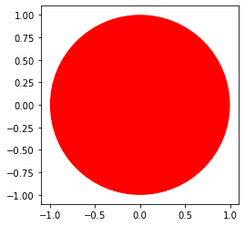
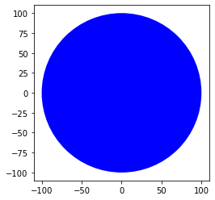

<a href="https://cognitiveclass.ai/">
    
</a>

<h1>Classes and Objects in Python</h1>

<p>
    <strong>Welcome!</strong> 
    Objects in programming are like objects in real life. Like life, there are different classes of objects. In this notebook, we will create two classes called Circle and Rectangle. By the end of this notebook, you will have a better idea about :
    <ul>
        <li>what a class is</li>
        <li>what an attribute is</li>
        <li>what a method is</li>
    </ul>

   Don’t worry if you don’t get it the first time, as much of the terminology is confusing. Don’t forget to do the practice tests in the notebook.
</p>

<div class="alert alert-block alert-info" style="margin-top: 20px">
    <a href="https://cocl.us/topNotebooksPython101Coursera">
         
    </a>
</div>

<h2>Table of Contents</h2>
<div class="alert alert-block alert-info" style="margin-top: 20px">
    <ul>
        <li>
            <a href="#intro">Introduction to Classes and Objects</a>
            <ul>
                <li><a href="create">Creating a class</a></li>
                <li><a href="instance">Instances of a Class: Objects and Attributes</a></li>
                <li><a href="method">Methods</a></li>
            </ul>
        </li>
        <li><a href="creating">Creating a class</a></li>
        <li><a href="circle">Creating an instance of a class Circle</a></li>
        <li><a href="rect">The Rectangle Class</a></li>
    </ul>
    <p>
        Estimated time needed: <strong>40 min</strong>
    </p>
</div>

<hr>

<h2 id="intro">Introduction to Classes and Objects</h2>

<h3>Creating a Class</h3>

The first part of creating a class is giving it a name: In this notebook, we will create two classes, Circle and Rectangle. We need to determine all the data that make up that class, and we call that an attribute. Think about this step as creating a blue print that we will use to create objects. In figure 1 we see two classes, circle and rectangle. Each has their attributes, they are variables. The class circle has the attribute radius and color, while the rectangle has the attribute height and width. Let’s use the visual examples of these shapes before we get to the code, as this will help you get accustomed to the vocabulary.


<i>Figure 1: Classes circle and rectangle, and each has their own attributes. The class circle has the attribute radius and colour, the rectangle has the attribute height and width.</i>


<h3 id="instance">Instances of a Class: Objects and Attributes</h3>

An instance of an object is the realisation of a class, and in Figure 2 we see three instances of the class circle. We give each object a name: red circle, yellow circle and green circle. Each object has different attributes, so let's focus on the attribute of colour for each object.


<i>Figure 2: Three instances of the class circle or three objects of type circle.</i>

 The colour attribute for the red circle is the colour red, for the green circle object the colour attribute is green, and for the yellow circle the colour attribute is yellow.   


<h3 id="method">Methods</h3>

Methods give you a way to change or interact with the object; they are functions that interact with objects. For example, let’s say we would like to increase the radius by a specified amount of a circle. We can create a method called **add_radius(r)** that increases the radius by **r**. This is shown in figure 3, where after applying the method to the "orange circle object", the radius of the object increases accordingly. The “dot” notation means to apply the method to the object, which is essentially applying a function to the information in the object.

 

<i>Figure 3: Applying the method “add_radius” to the object orange circle object.</i>

<hr>

<h2 id="creating">Creating a Class</h2>

Now we are going to create a class circle, but first, we are going to import a library to draw the objects: 


```python
# Import the library

import matplotlib.pyplot as plt
%matplotlib inline  
```

 The first step in creating your own class is to use the <code>class</code> keyword, then the name of the class as shown in Figure 4. In this course the class parent will always be object: 


<i>Figure 4: Three instances of the class circle or three objects of type circle.</i>

The next step is a special method called a constructor <code>&#95;&#95;init&#95;&#95;</code>, which is used to initialize the object. The input are data attributes. The term <code>self</code> contains all the attributes in the set. For example the <code>self.color</code> gives the  value of the attribute color and <code>self.radius</code> will give you the radius of the object. We also have the method <code>add_radius()</code> with the parameter <code>r</code>, the method adds the value of <code>r</code> to the attribute radius. To access the radius we use the syntax <code>self.radius</code>. The labeled syntax is summarized in Figure 5:


<i>Figure 5: Labeled syntax of the object circle.</i>

The actual object is shown below. We include the method <code>drawCircle</code> to display the image of a circle. We set the default radius to 3 and the default colour to blue:


```python
# Create a class Circle

class Circle(object):
    
    # Constructor
    def __init__(self, radius=3, color='blue'):
        self.radius = radius
        self.color = color 
    
    # Method
    def add_radius(self, r):
        self.radius = self.radius + r
        return(self.radius)
    
    # Method
    def drawCircle(self):
        plt.gca().add_patch(plt.Circle((0, 0), radius=self.radius, fc=self.color))
        plt.axis('scaled')
        plt.show()  
```

<hr>

<h2 id="circle">Creating an instance of a class Circle</h2>

Let’s create the object <code>RedCircle</code> of type Circle to do the following:


```python
# Create an object RedCircle

RedCircle = Circle(10, 'red')
```

We can use the <code>dir</code> command to get a list of the object's methods. Many of them are default Python methods.


```python
# Find out the methods can be used on the object RedCircle

dir(RedCircle)
```


    ['__class__',
     '__delattr__',
     '__dict__',
     '__dir__',
     '__doc__',
     '__eq__',
     '__format__',
     '__ge__',
     '__getattribute__',
     '__gt__',
     '__hash__',
     '__init__',
     '__init_subclass__',
     '__le__',
     '__lt__',
     '__module__',
     '__ne__',
     '__new__',
     '__reduce__',
     '__reduce_ex__',
     '__repr__',
     '__setattr__',
     '__sizeof__',
     '__str__',
     '__subclasshook__',
     '__weakref__',
     'add_radius',
     'color',
     'drawCircle',
     'radius']


We can look at the data attributes of the object: 


```python
# Print the object attribute radius

RedCircle.radius
```


    10


```python
# Print the object attribute color

RedCircle.color
```


    'red'


 We can change the object's data attributes: 


```python
# Set the object attribute radius

RedCircle.radius = 1
RedCircle.radius
```


    1


 We can draw the object by using the method <code>drawCircle()</code>:


```python
# Call the method drawCircle

RedCircle.drawCircle()
```





We can increase the radius of the circle by applying the method <code>add_radius()</code>. Let increases the radius by 2 and then by 5:  


```python
# Use method to change the object attribute radius

print('Radius of object:',RedCircle.radius)
RedCircle.add_radius(2)
print('Radius of object of after applying the method add_radius(2):',RedCircle.radius)
RedCircle.add_radius(5)
print('Radius of object of after applying the method add_radius(5):',RedCircle.radius)
```

    Radius of object: 1
    Radius of object of after applying the method add_radius(2): 3
    Radius of object of after applying the method add_radius(5): 8


 Let’s  create a blue circle. As the default colour is blue, all we have to do is specify what the radius is:


```python
# Create a blue circle with a given radius

BlueCircle = Circle(radius=100)
```

 As before we can access the attributes of the instance of the class by using the dot notation:


```python
# Print the object attribute radius

BlueCircle.radius
```


    100


```python
# Print the object attribute color

BlueCircle.color
```


    'blue'


 We can draw the object by using the method <code>drawCircle()</code>:


```python
# Call the method drawCircle

BlueCircle.drawCircle()
```





Compare the x and y axis of the figure to the figure  for <code>RedCircle</code>; they are different.

<hr>

<h2 id="rect">The Rectangle Class</h2>

Let's create a class rectangle with the attributes of height, width and color. We will only add the method to draw the rectangle object:


```python
# Create a new Rectangle class for creating a rectangle object

class Rectangle(object):
    
    # Constructor
    def __init__(self, width=2, height=3, color='r'):
        self.height = height 
        self.width = width
        self.color = color
    
    # Method
    def drawRectangle(self):
        plt.gca().add_patch(plt.Rectangle((0, 0), self.width, self.height ,fc=self.color))
        plt.axis('scaled')
        plt.show()
```

Let’s create the object <code>SkinnyBlueRectangle</code> of type Rectangle. Its width will be 2 and height will be 3, and the color will be blue:


```python
# Create a new object rectangle

SkinnyBlueRectangle = Rectangle(2, 10, 'blue')
```

 As before we can access the attributes of the instance of the class by using the dot notation:


```python
# Print the object attribute height

SkinnyBlueRectangle.height 
```


    10


```python
# Print the object attribute width

SkinnyBlueRectangle.width
```


    2


```python
# Print the object attribute color

SkinnyBlueRectangle.color
```


    'blue'


 We can draw the object:


```python
# Use the drawRectangle method to draw the shape

SkinnyBlueRectangle.drawRectangle()
```


Let’s create the object <code>FatYellowRectangle</code> of type Rectangle :


```python
# Create a new object rectangle

FatYellowRectangle = Rectangle(20, 5, 'yellow')
```

 We can access the attributes of the instance of the class by using the dot notation:


```python
# Print the object attribute height

FatYellowRectangle.height 
```


    5


```python
# Print the object attribute width

FatYellowRectangle.width
```


    20


```python
# Print the object attribute color

FatYellowRectangle.color
```


    'yellow'


 We can draw the object:


```python
# Use the drawRectangle method to draw the shape

FatYellowRectangle.drawRectangle()
```


<hr>
<h2>The last exercise!</h2>
<p>Congratulations, you have completed your first lesson and hands-on lab in Python. However, there is one more thing you need to do. The Data Science community encourages sharing work. The best way to share and showcase your work is to share it on GitHub. By sharing your notebook on GitHub you are not only building your reputation with fellow data scientists, but you can also show it off when applying for a job. Even though this was your first piece of work, it is never too early to start building good habits. So, please read and follow <a href="https://cognitiveclass.ai/blog/data-scientists-stand-out-by-sharing-your-notebooks/" target="_blank">this article</a> to learn how to share your work.
<hr>

<div class="alert alert-block alert-info" style="margin-top: 20px">
<h2>Get IBM Watson Studio free of charge!</h2>
    <p><a href="https://cocl.us/bottemNotebooksPython101Coursera"></a></p>
</div>

<h3>About the Authors:</h3>  
<p><a href="https://www.linkedin.com/in/joseph-s-50398b136/" target="_blank">Joseph Santarcangelo</a> is a Data Scientist at IBM, and holds a PhD in Electrical Engineering. His research focused on using Machine Learning, Signal Processing, and Computer Vision to determine how videos impact human cognition. Joseph has been working for IBM since he completed his PhD.</p>

Other contributors: <a href="www.linkedin.com/in/jiahui-mavis-zhou-a4537814a">Mavis Zhou</a>

<hr>

<p>Copyright &copy; 2018 IBM Developer Skills Network. This notebook and its source code are released under the terms of the <a href="https://cognitiveclass.ai/mit-license/">MIT License</a>.</p>
